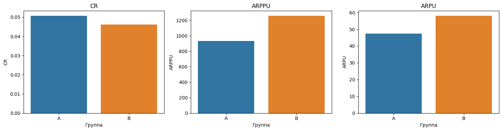
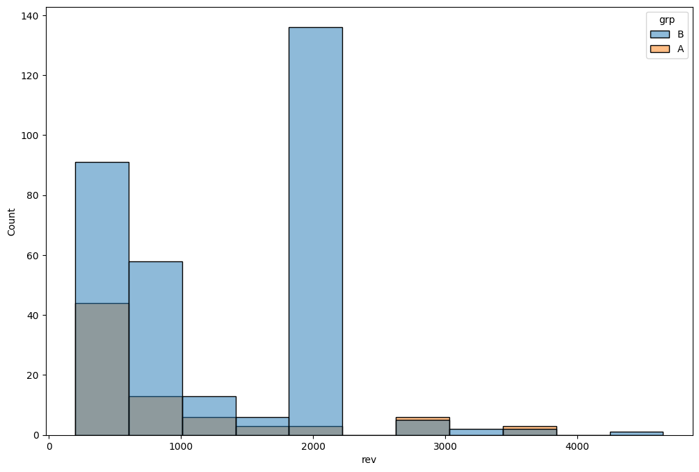
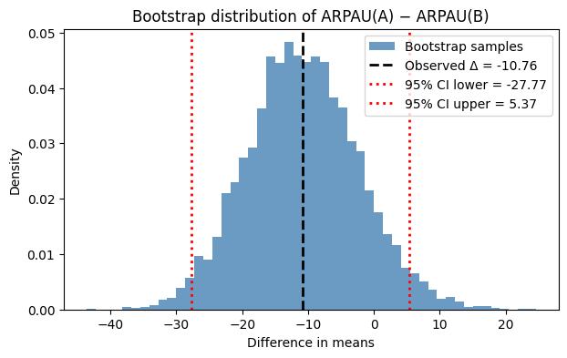

# A/B Test: New Payment Flow
[English version](README.md) | [Русская версия](README_RU.md)

This project analyses data from an online learning platform that introduced a **new payment mechanic**.  
The goal was to determine whether the change improved key monetisation metrics.

## Project Overview

**Objective:**  
Evaluate the impact of a new payment flow on user monetisation and conversion behaviour.

**Dataset:** anonymised platform data
* `groups.csv` - shows which group each user belongs to (A - control, B - test)
* `groups_add.csv` - an additional batch of users shared two days later
* `active_studs.csv` - contains users who visited the platform during the experiment
* `checks.csv` - includes payment data for the experiment period
  
**Period:** experiment duration (exact dates not provided)  
**Unit of analysis:** active user  
**Tools:** Python (pandas, numpy, scipy, statsmodels, pingoin, matplotlib, seaborn)

## Key Metrics

| Metric | Definition | Comment |
|---------|-------------|----------|
| **CR (Conversion Rate)** | Share of paying among active users | Guardrail metric |
| **ARPPU** | Average revenue per paying user | Reflects average check size |
| **ARPU** | Average revenue per active user | Measures total monetisation impact |

## Analysis Steps

1. **Data Processing & EDA**
   - Checked data consistency across tables 
   - Excluded 149 users with no activity (not affected by the test)

3. **Metric Calculation**
   - Calculated per-user CR, ARPPU, ARPU
   - Aggregated by group for summary comparison

  | Group | Assigned Users | Active Users | Paying Users | Total Revenue | ARPPU     | CR       | ARPU     |
|:------|----------------:|--------------:|--------------:|---------------:|-----------:|----------:|----------:|
| A     | 14,664          | 1,538         | 78            | 72,820.00      | 933.59     | 5.07%    | 47.35     |
| B     | 59,763          | 6,803         | 314           | 394,974.00     | 1,257.88   | 4.62%    | 58.06     |

4. **Statistical Testing**
   - **CR:** z-test for proportions - no significant difference  
   - **ARPPU:** Welch's t-test - significant increase in test group  
   - **ARPU:** bootstrap for difference in means - CI includes 0, no significant change  

## Conclusions

- **ARPPU increased**, indicating higher average spend per payer  
- **CR unchanged**, small and statistically insignificant movement  
- **ARPU unchanged**, meaning total monetization per active user did **not** improve  
- The rise in ARPPU was driven by a larger share of payments at the 1900 tier  
- **Business takeaway:** the new payment flow changed purchasing structure but didn’t raise total revenue

## Next Steps
You may extend the notebook with:
- Power & MDE estimation for CR and ARPU
- Segment-level comparison (new vs returning users)
- Time-series view of key metrics during the test period
