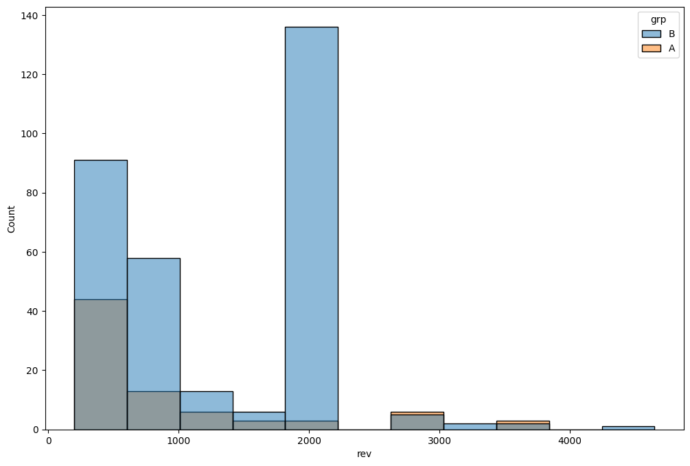

# A/B-тест: новая механика оплаты

[English version](README.md) | [Русская версия](README_RU.md)

Проект анализирует данные онлайн-платформы, на которой была внедрена **новая механика оплаты**.  
Цель — определить, улучшило ли изменение ключевые метрики монетизации.

---

## Обзор проекта

**Цель:**  
Оценить влияние новой механики оплаты на монетизацию и конверсию пользователей.

**Датасет:** анонимизированные данные платформы  
* `groups.csv` — распределение пользователей по группам (A — контроль, B — тест)  
* `groups_add.csv` — дополнительная выборка пользователей, добавленная спустя два дня  
* `active_studs.csv` — пользователи, проявившие активность во время эксперимента  
* `checks.csv` — данные об оплатах за период эксперимента  

**Период:** длительность эксперимента (точные даты не указаны)  
**Единица анализа:** активный пользователь  
**Инструменты:** Python (pandas, numpy, scipy, statsmodels, pingouin, matplotlib, seaborn)

---

## Ключевые метрики

| Метрика | Определение | Комментарий |
|----------|-------------|--------------|
| **CR (Conversion Rate)** | доля оплат среди активных пользователей | метрика-ограничитель (guardrail) |
| **ARPPU** | средний доход на платящего пользователя | отражает средний чек |
| **ARPU** | средний доход на активного пользователя | показывает общий эффект на монетизацию |

---

## Этапы анализа

1. **Обработка данных и EDA**
   - Проверена консистентность таблиц  
   - Исключены 149 пользователей без активности (на них изменение не могло повлиять)

2. **Расчёт метрик**
   - Рассчитаны CR, ARPPU, ARPU на уровне пользователя  
   - Проведена агрегация по группам для итогового сравнения  

| Группа | Назначенные пользователи | Активные пользователи | Платящие | Общая выручка | ARPPU | CR | ARPU |
|:------|----------------:|--------------:|--------------:|---------------:|-----------:|----------:|----------:|
| A | 14 664 | 1 538 | 78 | 72 820.00 | 933.59 | 5.07 % | 47.35 |
| B | 59 763 | 6 803 | 314 | 394 974.00 | 1 257.88 | 4.62 % | 58.06 |

3. **Статистические тесты**
   - **CR:** z-тест пропорций — различий не выявлено  
   - **ARPPU:** t-тест Уэлча — значимый рост в тестовой группе  
   - **ARPU:** бутстрап разности средних — доверительный интервал включает 0 → различий нет  

---

## Выводы

- **ARPPU вырос**, что указывает на увеличение среднего чека  
- **CR не изменился**, наблюдаемое снижение статистически незначимо  
- **ARPU не изменился**, совокупная монетизация на активного пользователя осталась прежней  
- Рост ARPPU связан с увеличением доли покупок по тарифу **1900 ₽**  
- **Бизнес-вывод:** новая механика изменила структуру покупок, но не повысила общий доход платформы

---

## Возможные доработки
- Расчёт мощности и MDE для метрик CR и ARPU  
- Анализ по сегментам (новые vs возвращающиеся пользователи)  
- Временной анализ динамики метрик в ходе эксперимента
